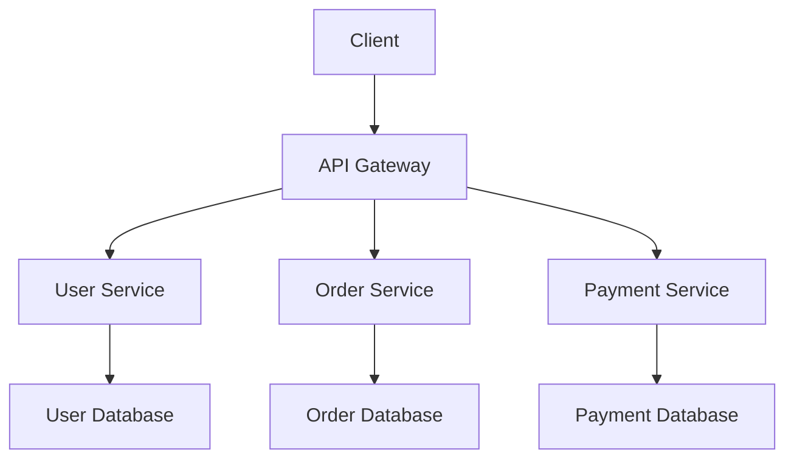

# AI Cursor Init

AI Cursor Init is a revolutionary documentation framework designed to streamline the development process by integrating AI-powered documentation generation directly into your IDE. This project addresses the common challenge of maintaining up-to-date technical documentation in fast-paced development environments.

## Key Features

### 🚀 Slash Commands
Generate comprehensive documentation with simple slash commands:
- `/adr` - Create Architecture Decision Records
- `/diagram` - Generate system diagrams
- `/onboard` - Create onboarding guides
- `/api` - Generate API documentation

### 🤖 AI-Powered Generation
Leverages advanced AI models to:
- Understand code context and architecture
- Generate accurate technical documentation
- Maintain consistency across documentation
- Adapt to different project structures

### 📊 Visual System Diagrams
Automatically generate:
- System architecture diagrams
- Data flow diagrams
- Component relationship maps
- Deployment diagrams

## Technical Implementation

### Core Technologies
- **TypeScript**: Primary development language
- **VS Code API**: IDE integration
- **OpenAI GPT**: AI model integration
- **Mermaid**: Diagram generation
- **Markdown**: Documentation format

### Architecture
The framework follows a modular architecture with clear separation of concerns:

```
src/
├── commands/          # Slash command handlers
├── ai/               # AI integration layer
├── generators/       # Documentation generators
├── templates/        # Documentation templates
└── utils/           # Utility functions
```

## Installation and Setup

### Prerequisites
- VS Code or Cursor IDE
- Node.js 16+
- OpenAI API key

### Installation
```bash
# Clone the repository
git clone https://github.com/mgiovani/ai-cursor-init.git

# Install dependencies
npm install

# Configure OpenAI API key
export OPENAI_API_KEY="your-api-key-here"

# Build the extension
npm run build
```

### Usage
1. Open your project in VS Code/Cursor
2. Use slash commands in any file
3. AI generates documentation based on your code
4. Review and customize the generated content

## Use Cases

### Architecture Decision Records (ADRs)
Document important architectural decisions with context and rationale:

```markdown
# ADR-001: Database Selection

## Status
Accepted

## Context
We need to choose a database for our new microservices architecture.

## Decision
We will use PostgreSQL as our primary database.

## Consequences
- Positive: ACID compliance, JSON support, excellent performance
- Negative: Requires more maintenance than NoSQL alternatives
```

### System Diagrams
Generate visual representations of your system architecture:



### Onboarding Guides
Create comprehensive guides for new team members:

```markdown
# Project Onboarding Guide

## Getting Started
1. Clone the repository
2. Install dependencies
3. Set up environment variables
4. Run the development server

## Project Structure
- `src/` - Source code
- `docs/` - Documentation
- `tests/` - Test files

## Development Workflow
1. Create feature branch
2. Make changes
3. Write tests
4. Submit pull request
```

## Benefits

### For Developers
- **Reduced Documentation Overhead**: Generate docs with simple commands
- **Consistent Documentation**: AI ensures consistent style and format
- **Time Savings**: Focus on coding instead of writing documentation
- **Better Onboarding**: New team members get comprehensive guides

### For Teams
- **Improved Knowledge Sharing**: Better documentation leads to better collaboration
- **Reduced Context Switching**: Stay in your IDE while generating docs
- **Standardized Processes**: Consistent documentation across projects
- **Better Project Understanding**: Visual diagrams help understand complex systems

## Future Roadmap

### Planned Features
- [ ] Integration with more IDEs
- [ ] Custom template support
- [ ] Team collaboration features
- [ ] Documentation versioning
- [ ] Automated testing documentation
- [ ] Code comment generation

### Community Contributions
We welcome contributions from the community! Areas where you can help:
- New slash commands
- Additional diagram types
- IDE integrations
- Documentation improvements
- Bug fixes and feature requests

## Getting Involved

### Contributing
1. Fork the repository
2. Create a feature branch
3. Make your changes
4. Add tests if applicable
5. Submit a pull request

### Reporting Issues
Found a bug or have a feature request? Please open an issue on GitHub with:
- Clear description of the problem
- Steps to reproduce
- Expected vs actual behavior
- Environment details

## License

This project is licensed under the MIT License - see the [LICENSE](LICENSE) file for details.

## Acknowledgments

- OpenAI for providing the AI models
- VS Code team for the excellent extension API
- Mermaid team for diagram generation
- The open-source community for inspiration and feedback

---

*AI Cursor Init - Making documentation as easy as writing code.*
